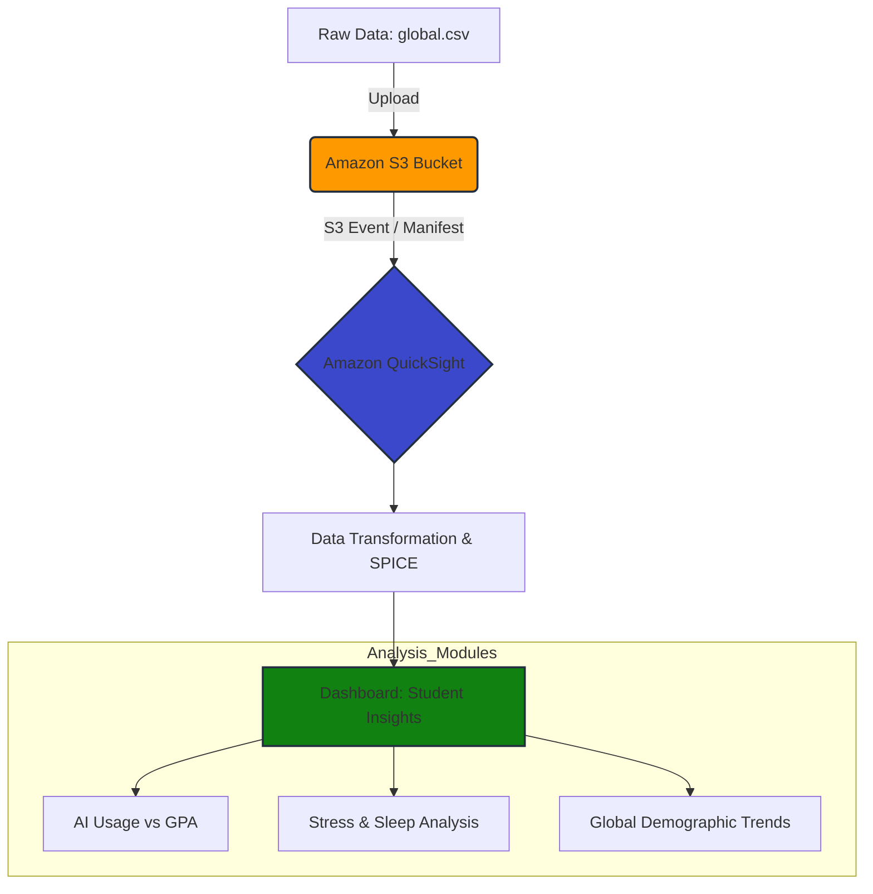

# Global Student Performance & Lifestyle Analysis 

https://github.com/user-attachments/assets/b9cedb79-2045-453e-a0ea-dbe5b05cd7df

An end-to-end AWS data pipeline designed to analyze and visualize lifestyle factors, AI tool adoption, and academic performance data for 10,000 students globally.

## 🏗️ Project Architecture

The following diagram illustrates the serverless workflow used to process and visualize the `global.csv` dataset:

🚀 Overview
The goal of this project was to identify the key drivers of student success in a modern, AI-integrated learning environment. By using Amazon S3 for scalable storage and Amazon QuickSight for business intelligence, I built a dashboard that processes 10,000 records to reveal patterns between mental health, technology use, and academic results.

🛠️ Tech Stack
Cloud Provider: AWS

Storage: Amazon S3 (Object Storage)

Business Intelligence: Amazon QuickSight (Serverless Analytics)

Data Source: global.csv (10,000 rows, 27 behavioral features)

📈 Key Insights Explored
AI Tool Impact: Correlation analysis between hours spent on tools like Claude, ChatGPT, and Gemini vs. final exam scores.

Lifestyle Balance: The relationship between sleep hours, exercise, and GPA.

Mental Wellness: Visualizing how internet quality and gaming hours impact reported mental stress levels.

📖 Implementation Steps
Data Lake Setup: Created a private S3 bucket and uploaded the global.csv dataset.

Manifest Configuration: Created a manifest.json file to define the S3 URI and data format for QuickSight ingestion.

IAM Permissions: Configured AWS IAM and QuickSight permissions to ensure secure access to the S3 bucket.

Data Modeling: Imported data into the SPICE engine, refining data types for GPA (Decimal) and exam_scores (Integer).

Dashboard Creation: Developed interactive visualizations, including heatmaps for stress levels and bar charts for brand/tool popularity.

📂 Repository Structure
data/manifest.json: Configuration for QuickSight data ingestion.

global.csv: The primary dataset.

screenshots/: Visual previews of the finalized AWS QuickSight dashboard.

🌟 Acknowledgments
Architecture inspired by AWS Best Practices for Serverless Data Visualization and the "Build-with-Me" series.
